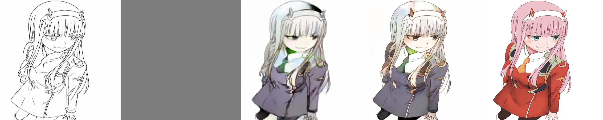
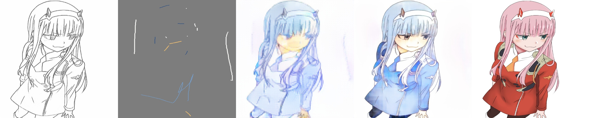
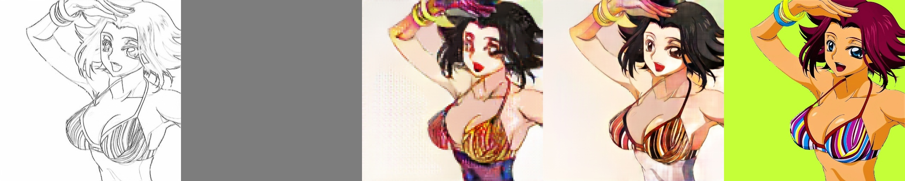
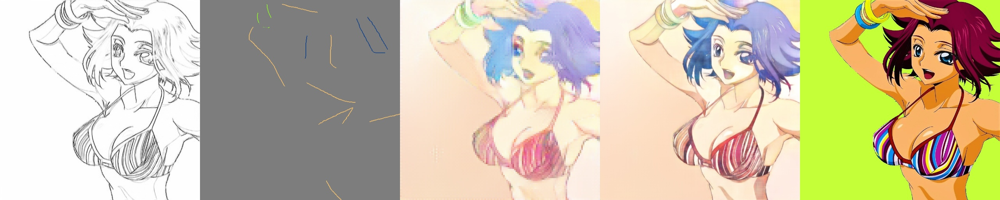
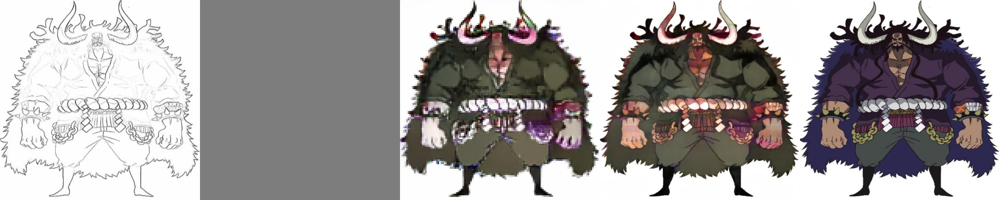
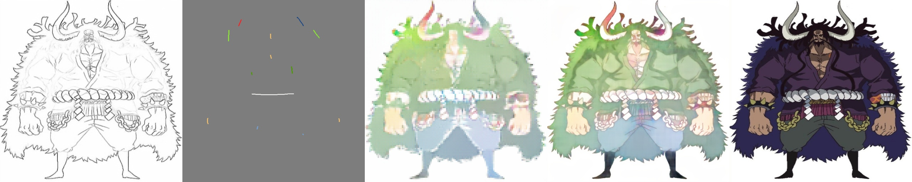
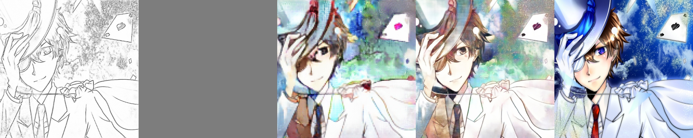
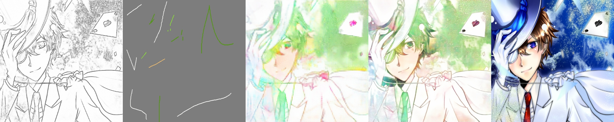
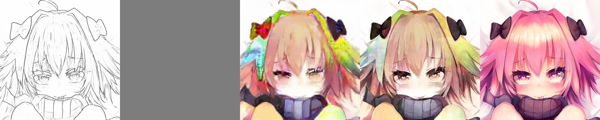
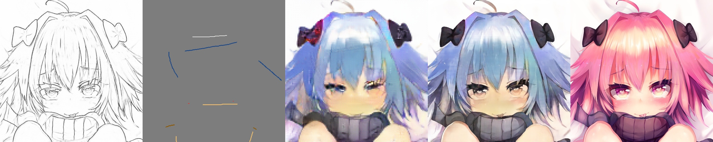

# PaintsTensorFlow


# Model Structure

<details>
<summary> Model Structure </summary>

## DraftModel


## Colorization


</details>

# Results

### input(line) - input(hint) - draft - output - ground truth

Gray background in hint for visualization.

  


<details>
<summary> More result image </summary>
  
  
  
  
  
  
  

</details>

# GUI

Current we does not provide a GUI.

instead, we are preparing a web service.

if you want to use it locally using the GUI, refer to tag:[0.0.1](https://github.com/rapidrabbit76/PaintsTensorFlow/tree/0.0.1)

<details>
<summary>GUI</summary>


File - open( select Image )


Click "Liner" to create line art


Click "RUN" to automatically color


Click "Color" to select a color and then draw a color hint


Click "RUN" to automatically color

</details>

# Requirements

- tensorflow==2.7.1
- tensorflow-addons==0.16.1
- albumentations==1.1.0
- opencv-python-headless==4.5.5.62 
- scipy==1.8.0
- tqdm==4.61.2
- wandb==0.12.11

# Pretrained Model
- draft saved_model [link](https://drive.google.com/drive/folders/1yKZ9gbVRznWP7ETowIqMbpZpveBh7Mhn?usp=sharing)
- colorization saved_model [link](https://drive.google.com/drive/folders/1yKZ9gbVRznWP7ETowIqMbpZpveBh7Mhn?usp=sharing)
- draft model onnx [link](https://drive.google.com/drive/folders/17A7db_zGxZllnlqjxf0_dkqIBeouACJa?usp=sharing)
- colorization model onnx [link](https://drive.google.com/drive/folders/17A7db_zGxZllnlqjxf0_dkqIBeouACJa?usp=sharing)

# Training

- My dataset over 700,000 images and created a lines, using [SketchKeras](https://github.com/lllyasviel/sketchKeras)

- dataset path structure (**image-line file name must be matched**)

  ```
  {DATASET PATH}
  │
  ├─ train
  │   ├─ image
  │   │    └─ 1.jpg, 2.jpg, N.jpg
  │   ├─ line
  │   │    └─ 1.jpg, 2.jpg, N.jpg
  └─ test
      ├─ image
      │    └─ 1.jpg, 2.jpg, N.jpg
      └─ line
          └─ 1.jpg, 2.jpg, N.jpg
  ```

- [step 1]: Training draft model 128X128 size

  ```
  python3 main.py \
  --mode="draft" \
  --root_dir={"YOURE DATASET PATH"} \
  --batch_size={BATCH_SIZE} \
  --epochs={EPOCHS} \
  --lr=0.0001
  ```

- [step 2]: Training Colorization model 512X512 size

  ```
  python3 main.py \
  --mode="colorization" \
  --root_dir={"YOURE DATASET PATH"} \
  --batch_size={BATCH_SIZE} \
  --epochs={EPOCHS} \
  --lr=0.0001
  ```

# Convert to ONNX

- check "[convert2onnx.ipynb](./convert2onnx.ipynb)"

# References

- [PaintsChainer](https://github.com/taizan/PaintsChainer/)
- [SketchKeras](https://github.com/lllyasviel/sketchKeras)
- [pix2pix](https://arxiv.org/pdf/1611.07004.pdf)
