# PaintsTensorFlow 
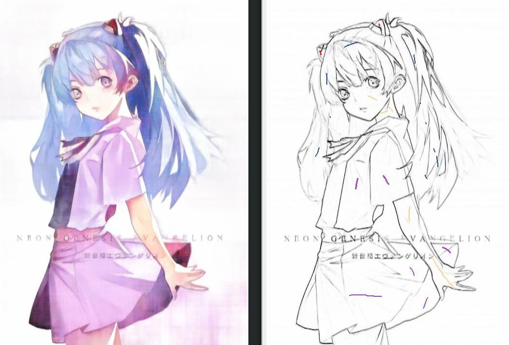

# Model Structure

# Results
### input(line) - input(hint) - draft - output - ground truth
Gray background in hint for visualization.  

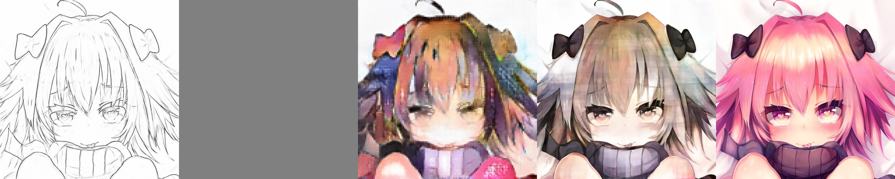  
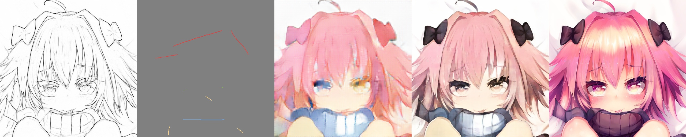  
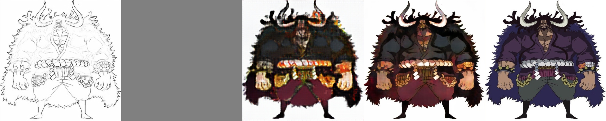  
  
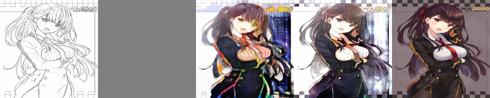  
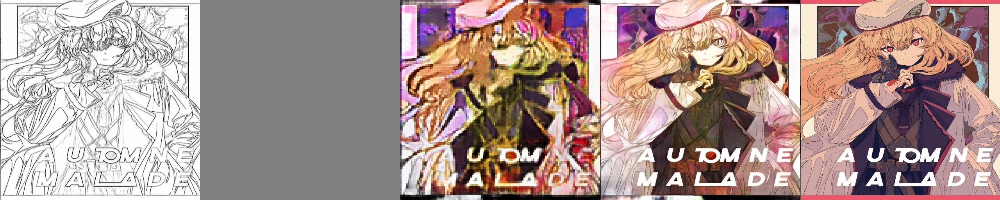  
  
  
  
  

# GUI
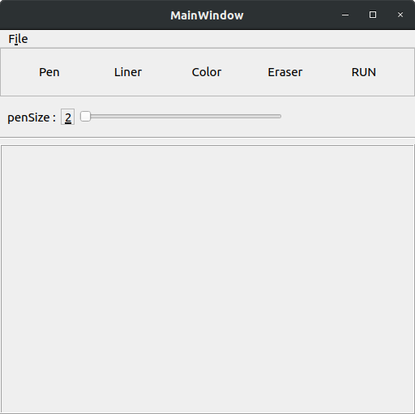

File - open( select Image )

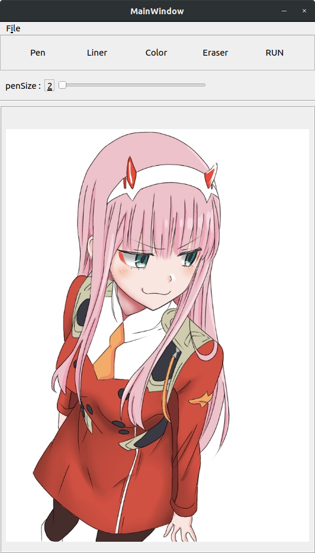

Click "Liner" to create line art

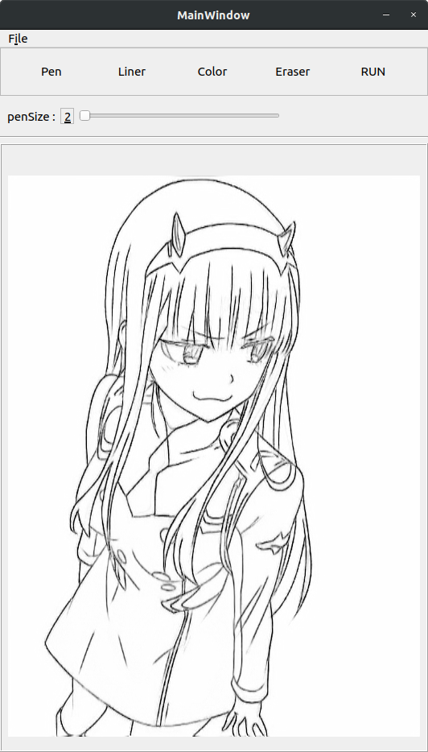

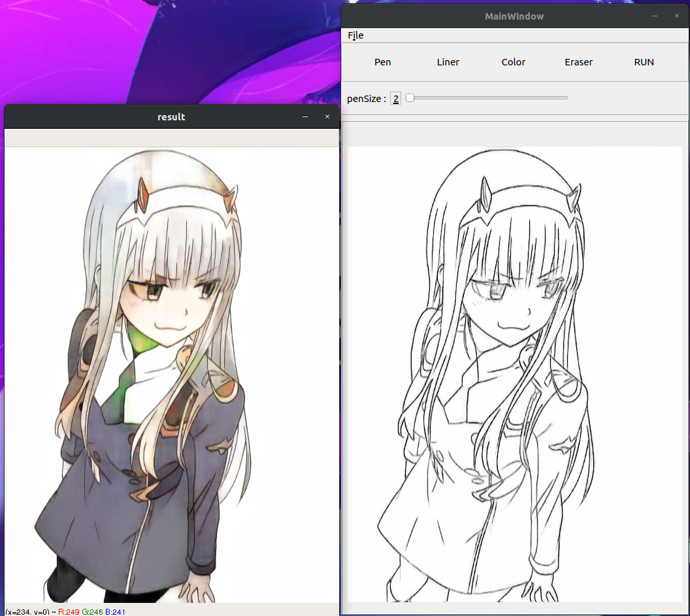  

Click "RUN" to automatically color

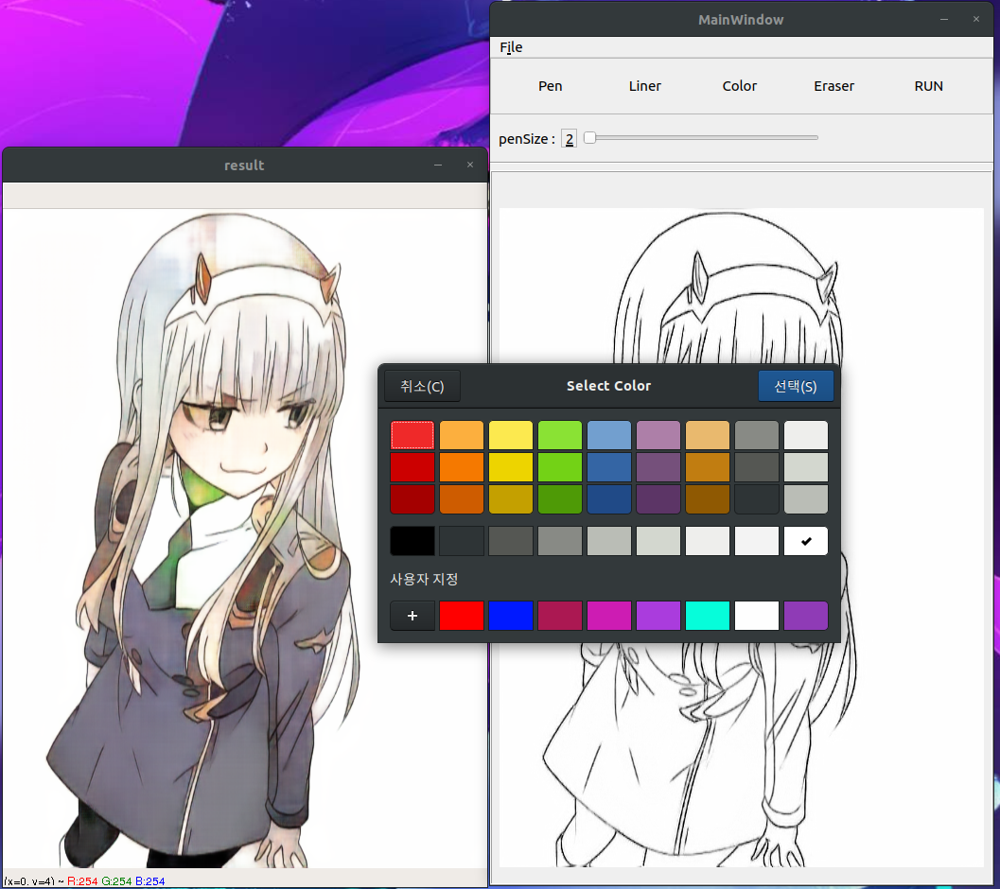  

Click "Color" to select a color and then draw a color hint

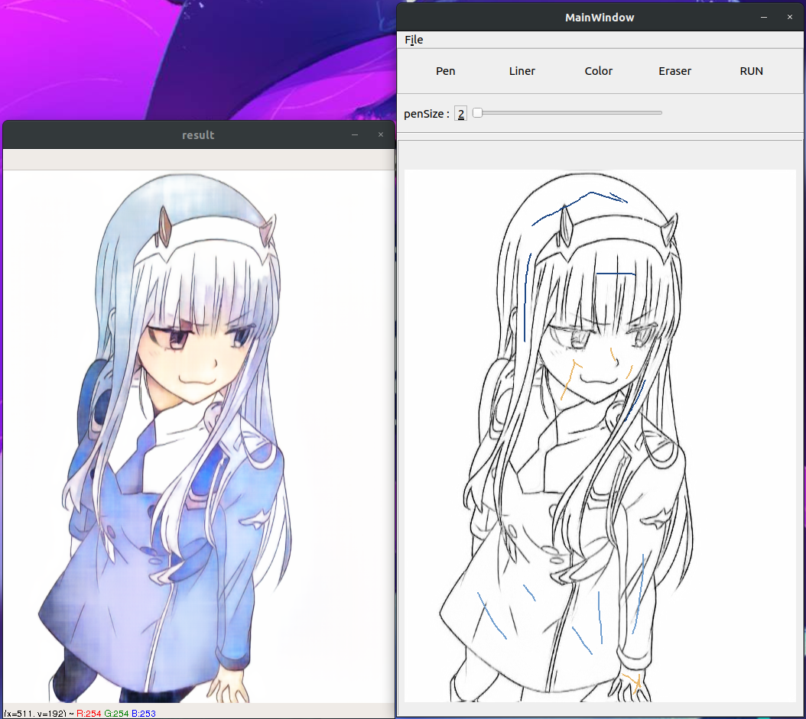  

Click "RUN" to automatically color

# Requirements  
* tensorflow_gpu==1.12. or tensorflow==1.12.0 # "1.13.1" is ok!
* numpy==1.15.4
* tensorlayer==1.11.1
* tqdm==4.28.1
* opencv_python==3.4.4.19
* scipy==1.1.0
* Pillow==5.3.0
* PyQt5==5.11.3

# Install  
1. pip install -r requirements.txt
2. Download saved_models [PaintsTensorFlowDraftModel](https://drive.google.com/file/d/1d6KMYplB2SPh6teDr22TKqc9Cnp0Isi2/view?usp=sharing), [PaintsTensorFlowModel](https://drive.google.com/file/d/1MyUz_jI8Su95KPxcn2s42NMEJSYTlKEu/view?usp=sharing), [Liner](https://drive.google.com/file/d/1h6rKAyWUfYGZd2J_L_nalPPfKbL8Br7Y/view?usp=sharing) and [Waifu2x](https://drive.google.com/open?id=1R86g3_G5INvVV4Vx4xiflezK_U5L5CwD)
    - **Liner** is **SketchKeras** model
3. Copy the files(**PaintsTensorFlowDraftModel, PaintsTensorFlowModel, Liner, Waifu2x**) into **"./GUI/src/saved_model/"**

4. python3 runGUI.py

# Training
- #### My Datasets are over 700,000 images and I created a lines, using [SketchKeras](https://github.com/lllyasviel/sketchKeras)

- #### I uses Eager mode in training step

- #### datasets path structure (**image-line fileName must be matched**)
        ├─ root
        │    ├─ train
        │    │    ├─ image (hyperparameter: train_image_datasets_path, ex: path/*.*)
        │    │    │    └─ 1.jpg, 2.jpg, 3.jpg 
        │    │    ├─ line  (hyperparameter: train_line_datasets_path, ex: path/*.*)
        │    │    │    └─ 1.jpg, 2.jpg, 3.jpg
        │    ├─ test
        │    │    ├─ image (hyperparameter: test_image_datasets_path, ex: path/*.*)
        │    │    │    └─ 1.jpg, 2.jpg, 3.jpg
        │    │    └─ line  (hyperparameter: test_line_datasets_path, ex: path/*.*)
        │    │         └─ 1.jpg, 2.jpg, 3.jpg
        
- ### step 1: Training draft model 128X128 size **Total 20 epoch**

        1.1. python3 training.py -loadEpochs 0 -mode draft

    hyperparameter.py : lr =  1e-4 , epoch = 10 , batch_size = in my case 8 recommendation is 4  

        1.2. python3 training.py -loadEpochs 9 -mode draft

    hyperparameter.py : lr =  1e-5 , epoch = 10 , batch_size = same as step 1.1
    
- ### step 2: Training model 512x512 size **Total 2 epoch**

        2.1. python3 training.py -loadEpochs 0 -mode 512

    hyperparameter.py : lr =  1e-4 , epoch = 1 , batch_size = in my case 3 recommendation is 4

        2.2. python3 training.py -loadEpochs 0 -mode 512

    hyperparameter.py : lr =  1e-5 , epoch = 1 , batch_size = same as step 2.1

# Loss
### Draft model Generator Loss

### 512x512px model Generator Loss

# References
- [PaintsChainer](https://github.com/taizan/PaintsChainer/)
- [SketchKeras](https://github.com/lllyasviel/sketchKeras)
- [pix2pix](https://arxiv.org/pdf/1611.07004.pdf)
